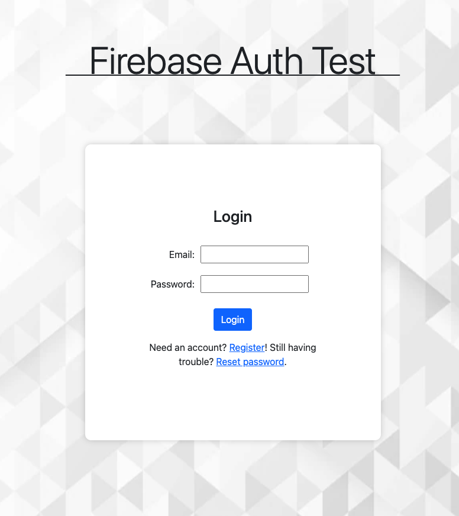
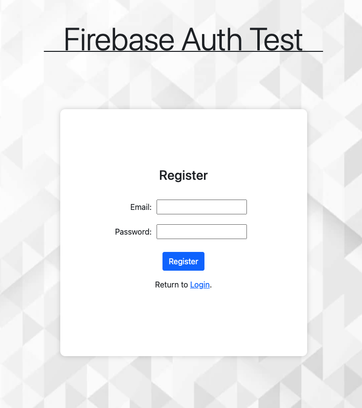
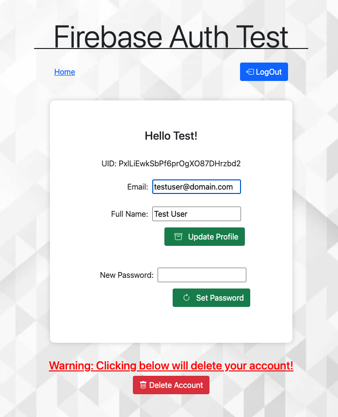
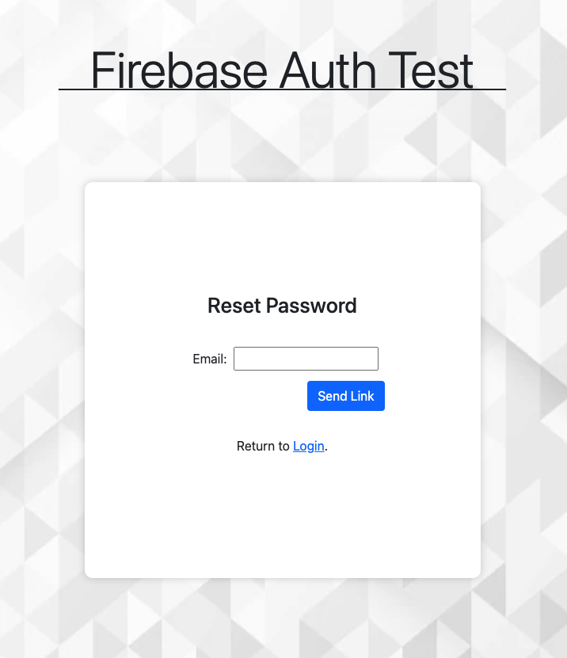

# Firebase Auth App
This project started as a simple app to test the Firebase Auth API using the email and password provider. It has since grown into a full-fledged app that allows users to sign up, sign in, sign out, and change their email address. It also allows users to reset their password in the app and request a password reset link. 

## Screenshot(s):

## Getting Started
Site hosted on [Netlify](https://dreamy-marigold-41a0c2.netlify.app)

## Technologies Used: 
* [Firebase](https://firebase.google.com/) - The backend platform used
* React
* Bootstrap
* Javascript

### Features:
- [x] Landing Page
  - [x] Login
  - [x] Register
  - [x] Request Password Reset Link
- [ ] Authenticated Pages
  - [x] Logout Current User
  - [x] Profile
    - [x] Update Profile
      - [x] Email
      - [x] Display Name
      - [x] Change Password
    - [x] Delete Account

### Future Features:
- [ ] Additional Providers
  - [ ] Google
  - [ ] Facebook
